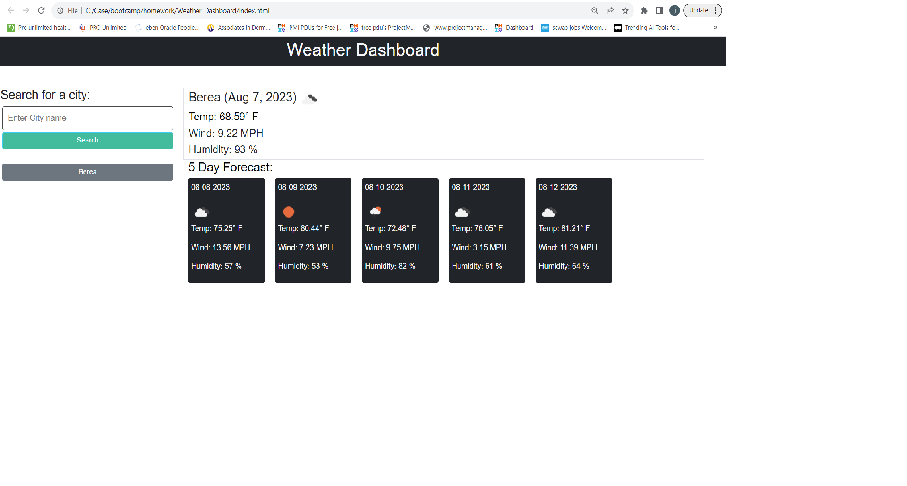

# Weather-Dashboard

## Description

This project will use third-party APIs to access current and 5 day weather forecast for cities to are either entered using a prompt, or selected from a history of searched cities. This application will build a weather dashboard that will run in the browser and feature dynamically updated HTML and CSS.

The application will use the [5 Day Weather Forecast](https://openweathermap.org/forecast5) to retrieve weather data for cities. 

## Usage

To use the Weather-Dashboard website, please visit <https://mcgreevyjim66.github.io/Weather-Dashboard/>

## Source

My repo, is located at <https://github.com/mcgreevyjim66/Weather-Dashboard>.
There is source code located in the Weather-Dashboard folder, as well as in the ./assets/images, ./assets/css and ./assets/js folders.

## Mock-up

## Credits

Author: Jim McGreevy
Date:   8/7/2023

